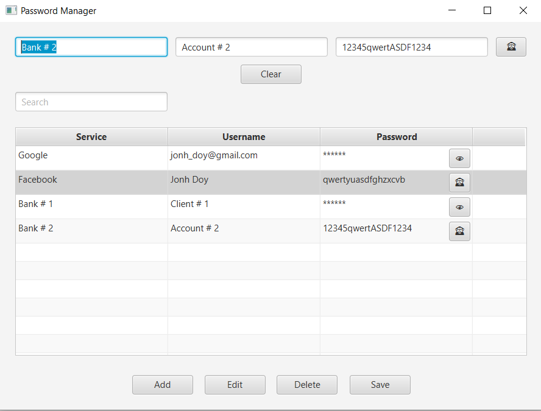

# Password Manager
***(IN PROGRESS)***

This project demonstrates work with GUI (JavaFX 21), security, files, and data encryption.

## Table of contents
1. [Description](#description)
2. [Tehnologies](#technologies)
3. [Installation and Launch](#installation-and-launch)
4. [Author](#author)
5. [License](#license)
6. [Usage Examples](#usage-examples)
7. [Screenshots](#screenshots)

## Description
The Password Manager project was developed to reinforce skills in working with GUI (JavaFX), data encryption,
files, and security tools.

### Main functions:
- Create/add a new password (service name, login, password).
- View a list of saved passwords (service name, login, password).
- Search by service name.
- Delete/edit a record.

## Technologies
- **Java 21**
- **JavaFX** (GUI)
- **Java Cryptography** (Data encryption, AES)
- **JSON** (Data storage)
- **Maven** (Build)

## Installation and Launch
1. Clone the repository:

   ```bash
   git clone https://github.com/YuliyaZimenina/PassworManager.git
   cd PasswordManager
   ```
2. Open the project in your favorite IDE (IntelliJ IDEA, Eclipse, etc.).
3. Run the application (for example):
   - Open the terminal in IntelliJ IDEA
   - Type the command:

   ```bash
   mvn javafx:run
   ```
4. Password to enter the application: admin

## Author

[Yuliya Zimenina](https://github.com/YuliyaZimenina)

## License

This project is distributed under the MIT license.

## Usage Examples

**Main class:**
```java

import javafx.application.Application;
import javafx.fxml.FXMLLoader;
import javafx.scene.Scene;
import javafx.scene.control.Alert;
import javafx.stage.Stage;
import com.zimenina.yuliya.util.AESUtil;
import java.io.IOException;

/**
 * Main class for the Password Manager application.
 * Initializes the application and delegates master password handling.
 */
public class Main extends Application {
   @Override
   public void start(Stage primaryStage) throws Exception {
      MasterPasswordManager passwordManager = new MasterPasswordManager();
      String masterPassword = passwordManager.authenticate(primaryStage);

      if (masterPassword != null) {
         loadMainWindow(primaryStage, masterPassword);
      } else {
         primaryStage.close();
      }
   }

   /**
    * Loads the main application window after successful authentication.
    */
   private void loadMainWindow(Stage primaryStage, String masterPassword) {
      try {
         AESUtil.setMasterPassword(masterPassword);
         FXMLLoader loader = new FXMLLoader(getClass().getResource("/fxml/main.fxml"));
         primaryStage.setTitle("Password Manager");
         primaryStage.setScene(new Scene(loader.load()));
         primaryStage.show();
      } catch (IOException e) {
         Alert alert = new Alert(Alert.AlertType.ERROR);
         alert.setTitle("Error");
         alert.setHeaderText(null);
         alert.setContentText("Failed to load the main window.");
         alert.showAndWait();
         primaryStage.close();
      }
   }

   public static void main(String[] args) {
      launch(args);
   }
}

```

## Screenshots

To enter the application, you need to enter your login on the start page.


The application has a simple and user-friendly interface. The main window displays a list of saved passwords, and users can add, edit, or delete records as needed.


The application allows users to add new passwords, including the service name, login, and password.


User data is presented in a convenient table.


The application can hide/show the password in the table and in the password input field.



The application implements a search for records by service name.


